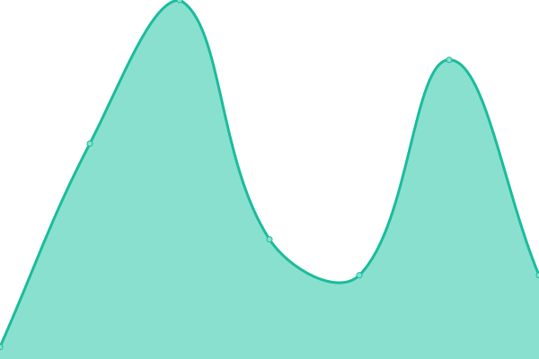
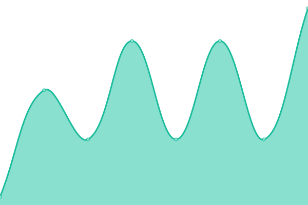
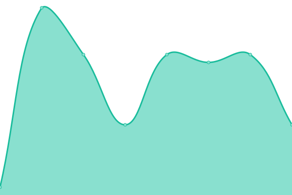

# [📈 Live Status](https://martymarty004.github.io/ha-upptime): <!--live status--> **🟧 Partial outage**

This repository contains the open-source uptime monitor and status page for [Martino Papero](https://martymarty004.github.io/ha-upptime), powered by [Upptime](https://github.com/upptime/upptime).

With [Upptime](https://upptime.js.org), you can get your own unlimited and free uptime monitor and status page, powered entirely by a GitHub repository. We use [Issues](https://github.com/martymarty004/ha-upptime/issues) as incident reports, [Actions](https://github.com/martymarty004/ha-upptime/actions) as uptime monitors, and [Pages](https://martymarty004.github.io/ha-upptime) for the status page.

<!--start: status pages-->
<!-- This summary is generated by Upptime (https://github.com/upptime/upptime) -->
<!-- Do not edit this manually, your changes will be overwritten -->
<!-- prettier-ignore -->
| URL | Status | History | Response Time | Uptime |
| --- | ------ | ------- | ------------- | ------ |
|  Home Assistant | 🟩 Up | [home-assistant.yml](https://github.com/martymarty004/ha-upptime/commits/HEAD/history/home-assistant.yml) | 

 499ms
     
 | 

<a href="https://martymarty004.github.io/ha-upptime/history/home-assistant">100.00%</a>
    

|  Fritz Pet | 🟩 Up | [fritz-pet.yml](https://github.com/martymarty004/ha-upptime/commits/HEAD/history/fritz-pet.yml) | 

 19ms
     
 | 

<a href="https://martymarty004.github.io/ha-upptime/history/fritz-pet">100.00%</a>
    

|  La Casa Blu | 🟩 Up | [la-casa-blu.yml](https://github.com/martymarty004/ha-upptime/commits/HEAD/history/la-casa-blu.yml) | 

 0ms
     
 | 

<a href="https://martymarty004.github.io/ha-upptime/history/la-casa-blu">100.00%</a>
    

|  Chuwi-01 | 🟩 Up | [chuwi-01.yml](https://github.com/martymarty004/ha-upptime/commits/HEAD/history/chuwi-01.yml) | 

 567ms
     
 | 

<a href="https://martymarty004.github.io/ha-upptime/history/chuwi-01">100.00%</a>
    

|  Chuwi-02 | 🟥 Down | [chuwi-02.yml](https://github.com/martymarty004/ha-upptime/commits/HEAD/history/chuwi-02.yml) | 

 3569ms
     
 | 

<a href="https://martymarty004.github.io/ha-upptime/history/chuwi-02">0.00%</a>
    

|  ZTE Iulian | 🟩 Up | [zte-iulian.yml](https://github.com/martymarty004/ha-upptime/commits/HEAD/history/zte-iulian.yml) | 

 17ms
     
 | 

<a href="https://martymarty004.github.io/ha-upptime/history/zte-iulian">100.00%</a>
    

|  EterniumH | 🟩 Up | [eternium-h.yml](https://github.com/martymarty004/ha-upptime/commits/HEAD/history/eternium-h.yml) | 

 707ms
     
 | 

<a href="https://martymarty004.github.io/ha-upptime/history/eternium-h">95.34%</a>
    

|  Fritz PF | 🟩 Up | [fritz-pf.yml](https://github.com/martymarty004/ha-upptime/commits/HEAD/history/fritz-pf.yml) | 

 18ms
     
 | 

<a href="https://martymarty004.github.io/ha-upptime/history/fritz-pf">100.00%</a>
    

|  [Piccola Fata](https://www.piccolafata.it/wp-json/) | 🟩 Up | [piccola-fata.yml](https://github.com/martymarty004/ha-upptime/commits/HEAD/history/piccola-fata.yml) | 

 3585ms
     
 | 

<a href="https://martymarty004.github.io/ha-upptime/history/piccola-fata">100.00%</a>
    

<!--end: status pages-->

[**Visit our status website →**](https://martymarty004.github.io/ha-upptime)

## 📄 License

- Powered by: [Upptime](https://github.com/upptime/upptime)
- Code: [MIT](./LICENSE) © [Anand Chowdhary](https://anandchowdhary.com), supported by [Pabio](https://pabio.com)
- Data in the `./history` directory: [Open Database License](https://opendatacommons.org/licenses/odbl/1-0/)
